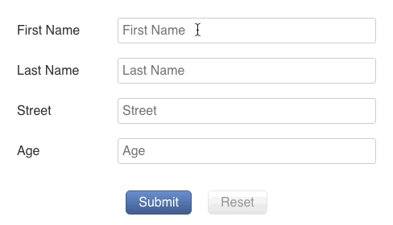

# 🏁 Final Form Focus 🧐

[](https://www.npmjs.com/package/final-form-focus)
[](https://www.npmjs.com/package/final-form-focus)
[](https://travis-ci.org/final-form/final-form-focus)
[](https://codecov.io/gh/final-form/final-form-focus)
[](https://github.com/prettier/prettier)

Decorator for [🏁 Final Form](https://github.com/final-form/final-form) that
will attempt to apply focus to the first field with an error upon an attempted form submission.

---

[](https://codesandbox.io/s/6174kqr403)

---

<!-- START doctoc generated TOC please keep comment here to allow auto update -->

<!-- DON'T EDIT THIS SECTION, INSTEAD RE-RUN doctoc TO UPDATE -->

<!-- DON'T EDIT THIS SECTION, INSTEAD RE-RUN doctoc TO UPDATE -->

* [Installation](#installation)
* [Usage](#usage)
  * [🏁 Final Form Usage](#-final-form-usage)
  * [🏁 React Final Form Usage](#-react-final-form-usage)
* [Example](#example)
  * [Focus On Error Example](#focus-on-error-example)
* [API](#api)
  * [`createDecorator: (getInputs?: GetInputs, findInput?: FindInput) => Decorator`](#createdecorator-getinputs-getinputs-findinput-findinput--decorator)
  * [`getFormInputs: (formName: string) => GetInputs`](#getforminputs-formname-string--getinputs)
* [Types](#types)
  * [`FocusableInput: { name: string, focus: () => void }`](#focusableinput--name-string-focus---void-)
  * [`GetInputs: () => FocusableInput[]`](#getinputs---focusableinput)
  * [`FindInput: (FocusableInput[], {}) => ?FocusableInput`](#findinput-focusableinput---focusableinput)

<!-- END doctoc generated TOC please keep comment here to allow auto update -->

## Installation

```bash
npm install --save final-form final-form-focus
```

or

```bash
yarn add final-form final-form-focus
```

## Usage

### 🏁 Final Form Usage

```js
import { createForm } from 'final-form'
import createDecorator from 'final-form-focus'

// Create Form
const form = createForm({ onSubmit })

// Create Decorator
const decorator = createDecorator()

// Decorate form
const undecorate = decorator(form)

// Use form as normal
```

### 🏁 React Final Form Usage

```js
import React from 'react'
import { Form, Field } from 'react-final-form'
import createDecorator from 'final-form-focus'

const focusOnErrors = createDecorator()
...
<Form
  onSubmit={submit}
  decorators={[ focusOnErrors ]} // <--------- 😎
  validate={validate}
  render={({ handleSubmit }) =>
    <form onSubmit={handleSubmit}>

      ... inputs here ...

    </form>
  }
/>
```

## Example

### [Focus On Error Example](https://codesandbox.io/s/6174kqr403)

Demonstrates how 🏁 Final Form Focus 🧐 works with [🏁 React Final Form](https://github.com/final-form/react-final-form#-react-final-form).

## API

### `createDecorator: (getInputs?: GetInputs, findInput?: FindInput) => Decorator`

A function that takes an optional function to collect a list of focusable inputs on the page and provides a 🏁 Final Form [`Decorator`](https://github.com/final-form/final-form#decorator-form-formapi--unsubscribe) that will focus on the top-most input on the page with an error when a form submission fails. If no `getInputs` parameter is provided, it will use a generic one that will return all inputs that appear in `document.forms`. If no `findInput` parameter is provided, it will use a generic one that matches the name attribute of the focusable input with the path in the error object.

### `getFormInputs: (formName: string) => GetInputs`

A `GetInputs` generator that will narrow the list of inputs down to those contained in the named form, i.e. `document.forms[formName]`.

## Types

### `FocusableInput: { name: string, focus: () => void }`

A light abstraction of any input that has a `name` property and upon which `focus()` may be called.

### `GetInputs: () => FocusableInput[]`

A function that collects a list of focusable inputs that exist on the page.

### `FindInput: (FocusableInput[], {}) => ?FocusableInput`

A function that returns the first element in a list of focusable inputs that has an error
